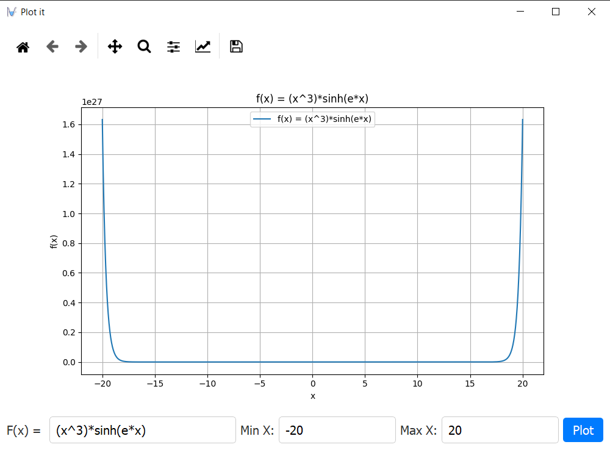

# Function Plotter

Function Plotter is a simple GUI application that allows users to plot mathematical functions and visualize them on a graph. It provides a user-friendly interface for entering the function, specifying the range of x-values, and plotting the function.

## Features

- Enter a mathematical function in a text field.
- Specify the range of x-values by providing minimum and maximum values.
- Plot the function on a graph using matplotlib.
- Support for common mathematical functions and operations (e.g., sqrt, exp, pi, sin, cos, tan).
- Interactive keyboard input to trigger function plotting.
- Error handling for invalid inputs and expressions.

## Prerequisites

Make sure you have the following dependencies installed:

- Python 3.x
- `matplotlib` library
- `PySide2` library

You can install the required dependencies using the following command:

```shell
pip install matplotlib PySide2
```

## Usage

To run the Function Plotter application, execute the following command:

```shell
python main.py
```

Upon launching the application, you will see a graphical window with the following components:

- Text field: Enter the mathematical function you want to plot.
- Range inputs: Specify the minimum and maximum values for the x-axis range.
- Plot button: Click this button to plot the function on the graph.
- Graph area: Displays the plotted graph.

Enter the function expression, set the range, and click the plot button to visualize the function on the graph. The graph will update accordingly, showing the plotted function.

>You can also use the keyboard shortcut "Enter" to trigger the function plotting without clicking the plot button.

>To exit the application, press the "Esc" key or close the window.

## Testing

The Function Plotter application has been tested using `pytest` and `numpy testing` to ensure the correctness of its functionalities. To run the tests, make sure you have `pytest` and `numpy testing` installed. You can install them using the following command:

```shell
pip install pytest numpy
```

Once installed, you can run the tests by executing the following command in the project directory:

```shell
pytest
```

The test suite includes unit tests and end-to-end tests to verify the behavior of the application's main features.

## Screenshots


<hr>


<hr>


<hr>


<hr>


<hr>



## Contributing

Contributions are welcome! If you find any issues or have suggestions for improvements, please submit an issue or a pull request on the GitHub repository.
